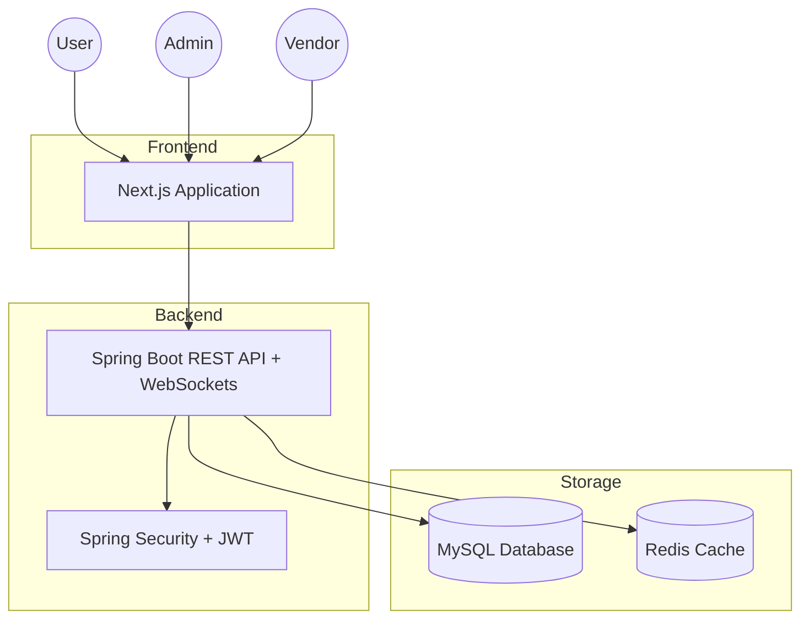

# Wedding Planner – Full-Stack Platform with Advanced DSA Integration

## Project Overview
A production-grade full-stack platform for wedding planning, demonstrating advanced backend engineering, system design, and the application of complex Data Structures & Algorithms (DSA) to real-world business workflows.

## Tech Stack
- **Frontend:** Next.js (React), Tailwind CSS, Axios, WebSocket (STOMP)
- **Backend:** Spring Boot, Spring Security (JWT), Spring Data JPA (Hibernate), Spring WebSocket (STOMP)
- **Database:** MySQL (relational, indexed schema)
- **Cache:** Redis (LRU cache, Pub/Sub) - *Planned*
- **Containerization:** Docker & Docker Compose

## High-Level Architecture

## DSA Mapping to Features
| Feature | Algorithm / Data Structure | Purpose |
| :--- | :--- | :--- |
| **Booking Conflict Detection** | Interval Tree / Segment Tree | Efficiently check for overlapping vendor bookings. |
| **Vendor Availability** | Sweep Line | Manage and visualize complex scheduling availability. |
| **Recommendation Engine** | Graph + Dijkstra | Suggest vendors based on location, budget, and ratings. |
| **Smart Search** | Trie + Top-K | Real-time autocomplete and popular search suggestions. |
| **Message Ordering** | Priority Queue (Min Heap) | Ensure chat messages are processed in correct sequence. |
| **Chat Spam Detection** | Sliding Window + Hashing | Detect repetitive or suspicious message patterns. |
| **Booking Load Balancing** | Min Heap + Greedy | Assign bookings to vendors based on current capacity. |
| **Recommendation Caching** | LRU Cache | Store frequent recommendation results for fast access. |
| **Chat Access Validation** | DFS/BFS | Validate user permissions within nested chat/group structures. |
| **Analytics & Reporting** | Fenwick Tree / Prefix Sum | Rapidly calculate point-in-time and range-based stats. |

## Repository Structure
- `frontend/`: Next.js application.
- `backend/`: Spring Boot application.
- `algorithms/`: Standalone DSA implementations in Java.
- `docker/`: Dockerfiles and `docker-compose.yml`.
- `docs/`: System design, DB schema, and interview notes.

## Setup Instructions
*(Detailed setup instructions will be added as implementation progresses)*
1. Clone the repository.
2. Navigate to `docker/` and run `docker-compose up -d`.
3. Follow individual service READMEs in `frontend/` and `backend/`.

## Quality Standards
- Clean, modular code structure.
- Comprehensive unit tests for DSA modules.
- Production-oriented design (DRY, SOLID, Design Patterns).
- Secure JWT-based authentication.
